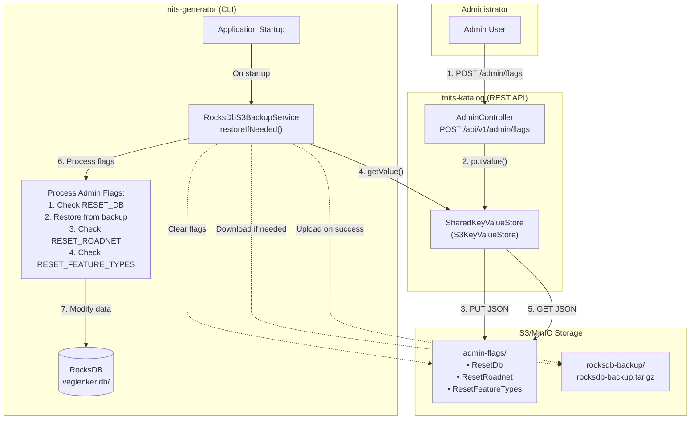
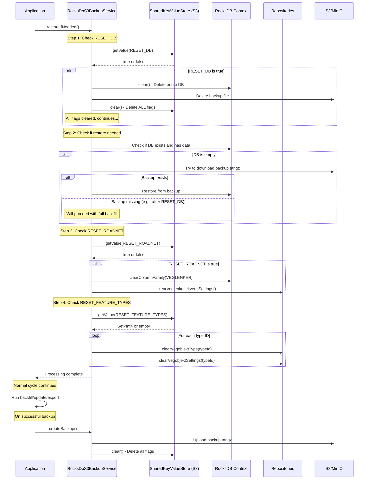
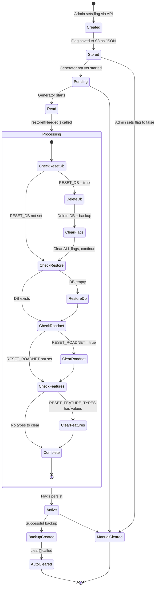

# Admin Flags

This document describes the admin flags system that enables remote control of the tnits-generator's data state through the tnits-katalog REST API.

Diagrams are written in [Mermaid](https://mermaid.js.org) syntax; use [IntelliJ Mermaid Plugin](https://plugins.jetbrains.com/plugin/20146-mermaid) to view them in the IDE.

## Overview

The admin flags system allows administrators to remotely trigger data resets in the tnits-generator by setting flags through the tnits-katalog REST API. Flags are stored in S3/MinIO and read by the generator on startup.

### Purpose

Admin flags enable:

- **Data corruption recovery** - Reset database when data becomes corrupted
- **Force full re-sync** - Clear specific data types to trigger complete refresh from NVDB
- **Operational maintenance** - Reset road network or feature types independently
- **Testing workflows** - Quickly reset specific parts of the system during development

### Architecture

Flags provide a bridge between the katalog (REST API) and generator (CLI) services:

1. **tnits-katalog** (REST API) - Sets flags through authenticated endpoint
2. **S3/MinIO** (Object Store) - Persists flags as JSON files
3. **tnits-generator** (CLI) - Reads and processes flags on startup

## System Architecture



## Available Admin Flags

Three admin flags are available, each with specific effects on the generator's data state.

### RESET_DB

**Storage key:** `ResetDb`
**Value type:** `Boolean`
**Storage location:** `s3://{bucket}/admin-flags/ResetDb`

**Effect:**

- Deletes the entire RocksDB database (`veglenker.db/`)
- Deletes the S3 backup file (`rocksdb-backup.tar.gz`)
- Clears all admin flags (including itself)
- Forces complete re-initialization on next startup

**When to use:**

- Severe database corruption
- Complete system reset required
- Testing fresh installation scenarios

**Warning:** Most destructive option. All data will be lost and must be re-downloaded from NVDB.

### RESET_ROADNET

**Storage key:** `ResetRoadnet`
**Value type:** `Boolean`
**Storage location:** `s3://{bucket}/admin-flags/ResetRoadnet`

**Effect:**

- Clears the `VEGLENKER` column family in RocksDB
- Removes veglenkesekvens-related settings from key-value store
- Preserves all vegobjekter (road objects) data
- Triggers road network backfill on next cycle

**When to use:**

- Road network data corruption
- Force re-sync of road network only
- Road geometry issues requiring fresh data

**Note:** This flag persists until explicitly deleted or until a successful backup is created.

### RESET_FEATURE_TYPES

**Storage key:** `ResetFeatureTypes`
**Value type:** `Set<Int>` (vegobjekt type IDs)
**Storage location:** `s3://{bucket}/admin-flags/ResetFeatureTypes`

**Effect:**

- Clears specific vegobjekt types from the `VEGOBJEKTER` column family
- Removes type-specific settings for each type
- Preserves road network and other vegobjekt types
- Triggers backfill for specified types on next cycle

**When to use:**

- Specific feature type corruption (e.g., speed limits)
- Force re-sync of specific vegobjekt types
- Data quality issues in particular feature types

**Example types:**

- `105` - Speed limits (Fartsgrense)
- `616` - Lane sections (Feltstrekning)
- `821` - Functional road class (Funksjonell vegklasse)

**Note:** This flag persists until explicitly deleted or until a successful backup is created.

## Setting Admin Flags

### API Endpoint

```
POST /api/v1/admin/flags
```

### Query Parameters

| Parameter             | Type        | Description                            |
|-----------------------|-------------|----------------------------------------|
| `resetDb`             | `Boolean?`  | Set to `true` to reset entire database |
| `resetRoadnet`        | `Boolean?`  | Set to `true` to reset road network    |
| `resetFeatureTypeIds` | `Set<Int>?` | Set of vegobjekt type IDs to reset     |

**Note:** Setting a parameter to `false` (or empty set) will **delete** that flag.

### Examples

#### Reset Entire Database

```bash
curl -X POST "http://localhost:8999/api/v1/admin/flags?resetDb=true"
```

#### Reset Road Network Only

```bash
curl -X POST "http://localhost:8999/api/v1/admin/flags?resetRoadnet=true"
```

#### Clear Specific Feature Types

```bash
# Reset speed limits (105) and lane sections (616)
curl -X POST "http://localhost:8999/api/v1/admin/flags?resetFeatureTypeIds=105,616"
```

#### Clear a Flag

```bash
# Remove the RESET_ROADNET flag
curl -X POST "http://localhost:8999/api/v1/admin/flags?resetRoadnet=false"
```

## Processing Admin Flags

### Startup Processing

The generator processes admin flags during startup before beginning normal operations.

### Processing Flow



### Processing Order

1. **Check RESET_DB**
    - If true: Delete database, delete backup, clear **all** flags
    - Execution continues to next step

2. **Check if restore needed**
    - If database is empty/missing: Try to restore from S3 backup
    - If backup missing (e.g., deleted by RESET_DB): Proceed with full backfill
    - If database exists with data: Skip restore

3. **Check RESET_ROADNET**
    - If true: Clear `VEGLENKER` column family and related settings
    - (Note: Will be false if RESET_DB was processed, since it cleared all flags)

4. **Check RESET_FEATURE_TYPES**
    - For each type ID: Clear vegobjekter of that type and related settings
    - (Note: Will be empty if RESET_DB was processed, since it cleared all flags)

5. **Continue normal cycle**
    - Backfill runs for any cleared/missing data
    - Updates process as normal
    - Export generates TN-ITS files

### When Flags Are Cleared

**Automatic clearing:**

- `RESET_DB` - Cleared immediately when RESET_DB flag is processed
- `RESET_ROADNET` and `RESET_FEATURE_TYPES` - Cleared after successful backup creation

**Manual clearing:**

- Any flag can be cleared by setting it to `false` or `null` via the API

## Flag Lifecycle



## Storage Format

### S3 Object Structure

Flags are stored as individual JSON objects in S3:

```
s3://{bucket}/
  └── admin-flags/
      ├── ResetDb             # Boolean (true)
      ├── ResetRoadnet        # Boolean (true)
      └── ResetFeatureTypes   # JSON array [105, 616, 821]
```

### Example JSON Content

**ResetDb:**

```json
true
```

**ResetRoadnet:**

```json
true
```

**ResetFeatureTypes:**

```json
[
    105,
    616,
    821
]
```

## Configuration

### S3/MinIO Configuration

Both tnits-katalog and tnits-generator must share the same S3 bucket configuration.

**Required environment variables:**

```bash
export S3_ENDPOINT=http://localhost:9000
export S3_ACCESS_KEY=user
export S3_SECRET_KEY=password
export S3_BUCKET=nvdb-tnits-local-data-01
```

These can also be configured via `application.conf` files in each service.

## Security

### OAuth2 Authentication

The admin flags endpoint requires OAuth2 authentication with the `nvdbapi=admin` scope.

The endpoint is protected by Spring Security and requires a valid OAuth2 JWT token with the appropriate scope claim.

### Local Development

For local development, use the mock OAuth server provided via Docker Compose:

**Start mock server:**

```bash
docker compose up -d
```

The mock OAuth server runs on `http://localhost:8099/Employees` and provides test tokens with the required `nvdbapi=admin` scope.

**Run katalog with security enabled:**

```bash
./gradlew tnits-katalog:bootRun --args='--spring.profiles.active=local,local-security'
```

## Related Documentation

- [Architecture Overview](ARCHITECTURE.md) - System architecture
- [Storage Architecture](STORAGE.md) - RocksDB details and operations
- [Getting Started](GETTING_STARTED.md) - Setup and first run
- [Data Flow](DATA_FLOW.md) - How data flows through the system
