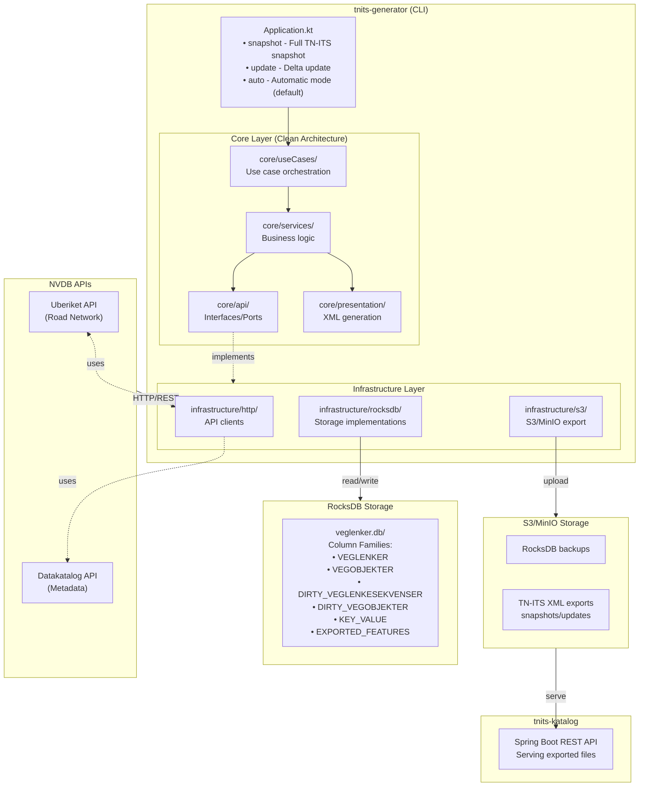

# Architecture Overview

This document provides a high-level overview of the nvdb-tnits system architecture.

Diagrams are written in [Mermaid](https://mermaid.js.org) syntax; use [IntelliJ Mermaid Plugin](https://plugins.jetbrains.com/plugin/20146-mermaid) to view them in the IDE.

## System Purpose

The system synchronizes road network data from the Norwegian Road Database (NVDB) and exports it in TN-ITS (Transport Network - Intelligent Transport Systems) format for European data exchange.

## High-Level Architecture



## Module Structure

### tnits-generator

The core CLI application responsible for data synchronization and export, following clean architecture principles.

**Key responsibilities:**

- Fetch road network data from NVDB Uberiket API
- Store data efficiently in RocksDB
- Track changes and dirty state
- Generate TN-ITS XML exports (snapshots and updates)
- Manage S3 backups and exports

**Main entry point:** `Application.kt`

**Architecture layers:**

#### Core Layer (Business Logic)

- `core/api/` - Interfaces/ports defining contracts for repositories, services, and storage
- `core/useCases/` - Use case orchestration for snapshots, updates, and exports
- `core/services/` - Business logic services
    - `core/services/tnits/` - TN-ITS export logic and feature transformation
    - `core/services/vegnett/` - Road network logic and OpenLR encoding
    - `core/services/storage/` - Storage abstractions and batch operations
- `core/presentation/` - XML output formatting with streaming support
- `core/extensions/` - Utility extensions for geometry, flows, and data manipulation
- `core/model/` - Domain models representing road network concepts

#### Infrastructure Layer (Adapters)

- `infrastructure/http/` - HTTP clients for NVDB APIs (Uberiket and Datakatalog)
- `infrastructure/rocksdb/` - RocksDB storage implementations for repositories
- `infrastructure/s3/` - S3/MinIO implementations for exports and backups
- `infrastructure/ingest/` - NVDB data ingestion orchestrators and loaders

#### Configuration

- `config/` - Configuration loading (Hoplite)
- `MainModule.kt` - Dependency injection composition root

### tnits-katalog

Spring Boot REST service that serves exported TN-ITS files from MinIO/S3.

**Key responsibilities:**

- Provide HTTP access to generated TN-ITS files
- List available snapshots and updates
- Stream files directly from S3 storage

## Technology Stack

| Technology           | Purpose                        | Documentation                                                            |
|----------------------|--------------------------------|--------------------------------------------------------------------------|
| **Kotlin**           | Primary language               | [kotlin-lang.org](https://kotlinlang.org)                                |
| **Gradle**           | Build system                   | [gradle.org](https://gradle.org)                                         |
| **RocksDB**          | Embedded key-value storage     | [rocksdb.org](https://rocksdb.org)                                       |
| **Protocol Buffers** | Binary serialization           | [protobuf.dev](https://protobuf.dev)                                     |
| **Ktor Client**      | HTTP client for NVDB APIs      | [ktor.io/client](https://ktor.io/docs/client.html)                       |
| **JTS**              | Geospatial geometry operations | [locationtech.org/jts](https://locationtech.org/projects/jts)            |
| **GeoTools**         | Coordinate transformations     | [geotools.org](https://geotools.org)                                     |
| **OpenLR**           | Location referencing encoding  | [openlr.org](https://www.openlr.org)                                     |
| **MinIO SDK**        | S3-compatible object storage   | [min.io](https://min.io)                                                 |
| **Kotest**           | Testing framework              | [kotest.io](https://kotest.io)                                           |
| **Testcontainers**   | Integration testing            | [testcontainers.org](https://testcontainers.org)                         |
| **Spring Boot**      | katalog REST service           | [spring.io/projects/spring-boot](https://spring.io/projects/spring-boot) |
| **Koin**             | Dependency Injection           | [insert-koin.io](https://insert-koin.io)                                 |
| **Konsist**          | Architecture testing           | [konsist.lemonappdev.com](https://docs.konsist.lemonappdev.com)          |

## Data Flow

The system operates in three main phases:

### 1. Initial Backfill

Downloads all road network data and road objects from NVDB when starting from an empty database.

```
NVDB API → Fetch all road network → Store in RocksDB
          ↓
       Fetch all road objects → Store in RocksDB
```

### 2. Incremental Updates

Processes change events from NVDB to keep data current.

```
NVDB API → Fetch change events → Update RocksDB → Mark dirty
```

### 3. TN-ITS Export

Generates TN-ITS XML files from stored data, either as full snapshots or delta updates.

```
RocksDB → Process dirty items → Generate XML → Upload to S3
```

## Key Design Patterns

### Dependency Injection via Koin

The application uses **Koin** with annotations for dependency injection, following clean architecture dependency rules. Koin Annotations 2.2+ provides Jakarta (JSR-330) compatibility, allowing the use of standard `@Singleton` and `@Named` annotations.

**Key principles:**

- Core layer depends only on interfaces (ports)
- Infrastructure layer implements the interfaces (adapters)
- Dependencies flow inward (infrastructure → core)
- Automatic interface binding for repository pattern
- Component scanning for automatic discovery

**MainModule configuration:**

```kotlin
@Module
@Configuration
@ComponentScan
class MainModule {
    @Singleton
    fun appConfig() = loadConfig()

    @Singleton
    @Named("uberiketHttpClient")
    fun uberiketHttpClient(config: UberiketApiConfig) =
        createUberiketHttpClient(config.baseUrl)

    @Singleton
    fun minioClient(config: AppConfig): MinioClient = /* ... */
}
```

**Service declaration:**

```kotlin
@Singleton
class TnitsExportService(
    private val vegobjekterRepository: VegobjekterRepository,  // Interface injection
    private val cachedVegnett: CachedVegnett,
    private val featureTransformer: FeatureTransformer
) {
    // Business logic
}
```

**Automatic interface binding:**

```kotlin
// Implementation automatically binds to interface
@Singleton
class VegobjekterRocksDbStore(
    private val rocksDbContext: RocksDbContext
) : VegobjekterRepository {
    // Implementation
}
```

For comprehensive documentation on Koin usage, see [Koin Dependency Injection Guide](KOIN_DEPENDENCY_INJECTION.md).

### Architecture Testing with Konsist

The project uses **Konsist** to enforce clean architecture boundaries at compile time through unit tests. This ensures that the dependency rule (infrastructure → core, never core → infrastructure) is automatically validated in CI/CD.

**Test location:** `tnits-generator/src/test/kotlin/no/vegvesen/nvdb/tnits/generator/ArchitectureTest.kt`

**What it validates:**

- Core layer (`core.*`) must NOT depend on infrastructure layer (`infrastructure.*`)
- Infrastructure layer MAY depend on core layer (via interfaces in `core/api/`)

**How it works:**

```kotlin
@Test
fun `core layer does not depend on infrastructure`() {
    Konsist.scopeFromProduction()
        .assertArchitecture {
            val core = Layer("Core", "no.vegvesen.nvdb.tnits.generator.core..")
            val infrastructure = Layer("Infrastructure", "no.vegvesen.nvdb.tnits.generator.infrastructure..")

            core.doesNotDependOn(infrastructure)
        }
}
```

The test runs as part of the standard test suite and **fails the build** if any core class imports infrastructure classes, catching architecture violations early.

### Repository Pattern

Storage operations are abstracted through repository interfaces defined in the core layer:

- Road network repository - Manages veglenkesekvenser and veglenker
- Road objects repository - Manages vegobjekter with their properties
- Dirty checking repository - Tracks changed items for delta processing

The infrastructure layer provides concrete implementations using RocksDB for persistence.

### Unit-of-Work for Atomicity

Batch operations use the `writeBatch` context for atomic multi-operation transactions:

```kotlin
rocksDbContext.writeBatch {
    veglenkerStore.batchUpdate(updates)
    dirtyCheckingStore.markDirty(ids)
}
```

### Streaming Processing

Large XML exports use streaming to avoid memory issues:

- XML streaming via StAX for constant memory usage
- Parallel processing with worker pools
- Direct streaming to S3 without buffering entire file in memory

## Configuration

Configuration is loaded from `application.conf` with environment variable overrides using Hoplite.

**Configuration structure:**

```hocon
uberiketApi {
    baseUrl = "https://nvdbapiles.atlas.vegvesen.no/uberiket/api/v1/"
}

s3 {
    endpoint = "http://localhost:9000"
    accessKey = user
    secretKey = password
}

exporter {
    gzip = true
    target = S3
    bucket = nvdb-tnits-local-data-01
}

backup {
    enabled = true
    bucket = nvdb-tnits-local-data-01
    path = rocksdb-backup
}
```

## Performance Considerations

### RocksDB Optimization

- LZ4 compression for storage efficiency
- Column families for logical data separation
- Bulk loading configuration for initial backfill
- Batch operations for write efficiency

### Parallel Processing

- Multithreaded speed limit processing
- Worker pool architecture with step-lock orchestration
- Ordered output via post-processing sort

### Memory Management

- Streaming XML generation (no DOM)
- Lazy sequence processing for large datasets
- Protocol Buffers for compact serialization
- Optimized CachedVegnett with lazy computation and byte compression

See: [Memory Optimization Guide](MEMORY_OPTIMIZATION.md) for details on 72% memory reduction

## Related Documentation

- [Getting Started Guide](GETTING_STARTED.md) - Setup and first run
- [Storage Architecture](STORAGE.md) - RocksDB details
- [Data Flow](DATA_FLOW.md) - Processing pipeline
- [TN-ITS Export](TNITS_EXPORT.md) - Export functionality
- [Testing Guide](TESTING.md) - Test structure and execution
- [Concepts Glossary](CONCEPTS.md) - Domain terminology
- [Memory Optimization](MEMORY_OPTIMIZATION.md) - CachedVegnett memory optimization
