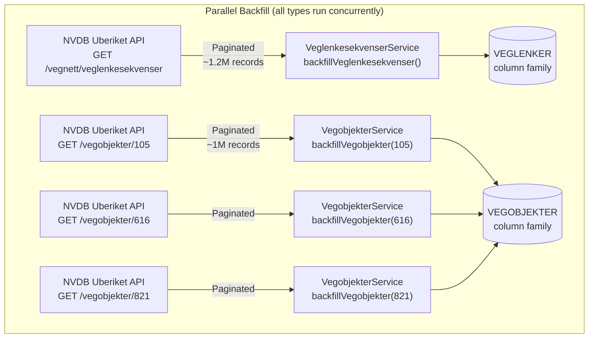
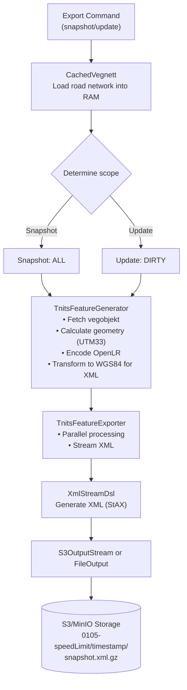
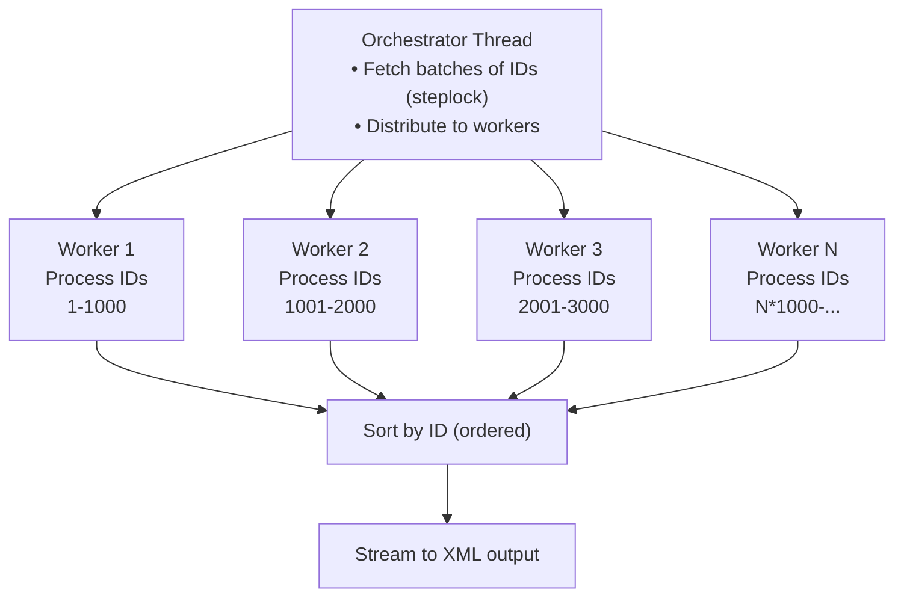

# Data Flow

This document describes how data flows through the nvdb-tnits system, from NVDB APIs to TN-ITS exports.

Diagrams are written in [Mermaid](https://mermaid.js.org) syntax; use [IntelliJ Mermaid Plugin](https://plugins.jetbrains.com/plugin/20146-mermaid) to view them in the IDE.

## Overview

The system operates in three main phases:

```
NVDB APIs → Backfill → Incremental Updates → TN-ITS Export → S3/MinIO
```

Each phase has specific responsibilities and data transformations.

## Phase 1: Initial Backfill

The backfill phase downloads all road network data from NVDB when starting from an empty database.

### Backfill Flow Diagram

All backfill operations run in parallel:



All operations launch concurrently in a `coroutineScope` and run in parallel. Only Speed Limits (type 105) and supporting types are shown here; additional types might also be backfilled following the same pattern.

### Backfill Process Details

#### Step 1: Veglenkesekvenser Backfill

```
Loop until all data fetched:
  1. Fetch batch of 1000 veglenkesekvenser (starting from last ID)
  2. Store batch in RocksDB
  3. Save progress (last ID)
  4. Continue from next ID
```

**API Endpoint:** `GET /vegnett/veglenkesekvenser`

**Data retrieved:**

- Veglenkesekvens ID
- List of veglenker (road links)
- Geometry (linestrings)
- Position data (start/stop along parent sequence)
- Field information (lanes, direction)

#### Step 2: Vegobjekter Backfill

```
For each vegobjekt type (e.g., speed limits):
  Loop until all data fetched:
    1. Fetch batch of 1000 vegobjekter (starting from last ID)
    2. Store batch in RocksDB
    3. Save progress (last ID per type)
    4. Continue from next ID
```

**API Endpoint:** `GET /vegobjekter/{typeId}`

**Data retrieved:**

- Vegobjekt ID and type
- Properties (e.g., speed limit value)
- Stedfesting (positioning on road network)
- Metadata (dates, versions)

### Backfill Performance

**Typical timings:**

- Veglenkesekvenser: ~20-30 minutes (~1.2M records)
- Speed limits (type 105): ~10-15 minutes (~1M records)
- Supporting types: ~5-10 minutes

**Optimization:**

- Batch inserts (1000 records per batch)
- Progress tracking (resumable on failure)
- Parallel processing

## Phase 2: Incremental Updates

After backfill completes, the system processes change events from NVDB to keep data current.

### Update Flow Diagram

The system processes two independent update streams in parallel:

```mermaid
flowchart TD
  subgraph veg["Veglenkesekvens Updates"]
    API_V["NVDB Uberiket Events API<br/>GET /hendelser/veglenkesekvenser"]
    SVC_V["VeglenkesekvensService<br/>updateVeglenkesekvenser()"]
    EVT_V["Process Events:<br/>VeglenkesekvensOpprettet<br/>VeglenkesekvensEndret<br/>VeglenkesekvensFjernet"]
    DB_V[("VEGLENKER +<br/>DIRTY_VEGLENKESEKVENSER")]
    API_V -->|" 1. Fetch hendelser "| SVC_V
    SVC_V -->|" 2. Process events "| EVT_V
    EVT_V -->|" 3. Update & mark dirty "| DB_V
  end

  subgraph obj["Vegobjekt Updates"]
    API_O["NVDB Uberiket Events API<br/>GET /hendelser/vegobjekter/{typeId}"]
    SVC_O["VegobjekterService<br/>updateVegobjekter()"]
    EVT_O["Process Events:<br/>VegobjektImportert<br/>VegobjektVersjonOpprettet<br/>VegobjektVersjonEndret<br/>VegobjektVersjonFjernet"]
    DB_O[("VEGOBJEKTER +<br/>DIRTY_VEGOBJEKTER")]
    API_O -->|" 1. Fetch hendelser "| SVC_O
    SVC_O -->|" 2. Process events "| EVT_O
    EVT_O -->|" 3. Update & mark dirty "| DB_O
  end
```



Both update processes run independently and can execute in parallel.

### Update Process Details

#### Event Types

**Veglenkesekvens Events:**

| Event Type                 | Description                    | RocksDB Operation   |
|----------------------------|--------------------------------|---------------------|
| `VeglenkesekvensOpprettet` | New or fully replaced sequence | Upsert + Mark dirty |
| `VeglenkesekvensEndret`    | Modified sequence              | Upsert + Mark dirty |
| `VeglenkesekvensFjernet`   | Removed sequence               | Delete + Mark dirty |

**Vegobjekt Events:**

| Event Type                  | Description                           | RocksDB Operation   |
|-----------------------------|---------------------------------------|---------------------|
| `VegobjektImportert`        | Imported object (initial creation)    | Insert + Mark dirty |
| `VegobjektVersjonOpprettet` | New version created (version 1 = new) | Insert + Mark dirty |
| `VegobjektVersjonEndret`    | Version modified                      | Update + Mark dirty |
| `VegobjektVersjonFjernet`   | Version removed (version 1 = deleted) | Delete + Mark dirty |

#### Veglenkesekvens Events

**Process:**

```
1. Fetch events since last processed event ID
2. For each batch of events:
   - Extract veglenkesekvens IDs from all event types
   - Fetch full current data for these IDs
   - Upsert or delete in RocksDB (null value = deleted)
   - Mark veglenkesekvenser as dirty
   - Save last processed event ID
```

**Note:** All event types are handled the same way - fetch full current data and upsert. Deleted sequences return null and are removed from storage.

#### Vegobjekt Events

**Process:**

```
1. Fetch events since last processed event ID
2. Classify events as NEW, MODIFIED, or DELETED:
   - VegobjektImportert → NEW
   - VegobjektVersjonOpprettet (version 1) → NEW
   - VegobjektVersjonFjernet (version 1) → DELETED
   - Other events → MODIFIED
3. Fetch full data for NEW/MODIFIED vegobjekt IDs
4. Update RocksDB atomically:
   - Insert/update vegobjekter and stedfestinger
   - Main types: mark vegobjekter as dirty
   - Supporting types: mark stedfestede veglenkesekvenser as dirty
   - Save last processed event ID
```

**Note:** Classification is based on version number. Version 1 events indicate true create/delete, while other versions are modifications.

### Update Performance

**Typical timings:**

- 0-100 events: ~1-2 seconds
- 100-1000 events: ~10-30 seconds
- 1000+ events: ~1-5 minutes

## Phase 3: TN-ITS Export

The export phase generates TN-ITS XML files from RocksDB data.

### Export Flow Diagram



### Export Types

#### Snapshot Export

**Purpose:** Full export of all current data

**Process:**

1. Load all vegobjekter of type
2. Generate TN-ITS features for each
3. Set `updateType = Snapshot` (not included in XML)
4. Include all active objects

**Output example:**

```
s3://bucket/0105-speedLimit/2025-10-06T12-00-00Z/snapshot.xml.gz
```

#### Update Export

**Purpose:** Delta export of only changed data since last snapshot/update

**Process:**

1. Query dirty vegobjekter
2. Query vegobjekter on dirty veglenkesekvenser
3. Generate TN-ITS features for dirty items
4. Set `updateType` to `Add`, `Modify`, or `Remove`
5. Include only changed objects

**Output example:**

```
s3://bucket/0105-speedLimit/2025-10-06T14-30-00Z/update.xml.gz
```

### Parallel Processing

The export uses parallel processing for performance:



**Worker count:** `Runtime.getRuntime().availableProcessors()`

### Data Transformations

#### 1. Stedfesting to Geometry

**Input:** Stedfesting (positioning on road network)

- Veglenkesekvens ID + start/stop position (0.0 to 1.0)
- Direction (MED/MOT)

**Process:**

1. Fetch veglenkesekvens geometry from cache
2. Calculate intersection with stedfesting range
3. Extract geometry segment

**Output:** JTS LineString in UTM33 projection

#### 2. OpenLR Encoding

**Input:** List of veglenker with geometry

**Process:**

1. Build OpenLR Line objects
2. Find FRC (Functional Road Class) from vegklasse
3. Determine bearing at nodes
4. Calculate offsets
5. Encode to binary OpenLR

**Output:** Base64-encoded OpenLR string

**Note:** Current implementation uses placeholder encoding. Real OpenLR encoding requires an OpenLR library.

#### 3. Coordinate Transformation

**Input:** Geometry in UTM33 (EPSG:25833) from storage

**Process:**

1. Geometry stored in RocksDB remains in UTM33
2. During TN-ITS XML export: Project to WGS84 (EPSG:4326)
3. Use GeoTools CRS transformation
4. Longitude/latitude order for OpenLR

**Output:** WGS84 coordinates (EPSG:4326) for TN-ITS XML

#### 4. Geometry Simplification

**Input:** High-resolution linestring

**Process:**

1. Apply Douglas-Peucker algorithm
2. Tolerance: configurable (e.g., 1.0 meter)
3. Preserve topology

**Output:** Simplified linestring (tolerance: ~1 meter)

## Data Dependencies

### Required Vegobjekt Types

| Type ID | Name                  | Purpose                        |
|---------|-----------------------|--------------------------------|
| **105** | Fartsgrense           | Speed limits (main export)     |
| **821** | Funksjonell vegklasse | FRC for OpenLR                 |
| **616** | Feltstrekning         | Direction for connection links |

**Type Configuration:**

- Main types: Speed limits (105)
- Supporting types: Feltstrekning (616), Funksjonell vegklasse (821)

## State Tracking

### Progress Tracking Keys

Stored in `KEY_VALUE` column family:

**Backfill progress:**

- `backfill_complete_veglenkesekvenser` → Boolean
- `backfill_complete_105` → Boolean (speed limits)

**Event processing:**

- `last_processed_event_id_veglenkesekvenser` → Long
- `last_processed_event_id_105` → Long

**Export timestamps:**

- `last_snapshot_105` → Instant
- `last_update_105` → Instant

### Dirty State Tracking

**Column families:**

- `DIRTY_VEGLENKESEKVENSER` → Set of veglenkesekvens IDs
- `DIRTY_VEGOBJEKTER` → Set of (typeId, objektId) pairs

**After successful export:** Dirty state is cleared for processed type

## Error Handling

### Retry Logic

NVDB API calls use exponential backoff retry:

- Max retries: 5
- Retry on server errors and timeouts
- Exponential delay up to 30 seconds

### Transaction Rollback

RocksDB batch operations are atomic - all operations succeed or all fail together.

### Progress Persistence

Progress is persisted after each batch, enabling resumable operations on restart.

## Performance Optimization

### Caching Strategy

**CachedVegnett:** Load entire road network into RAM

**Benefit:**

- Fast lookups during export (no RocksDB access)
- Enable complex spatial queries

**Memory usage:** ~2-3 GB for Norwegian road network

### Batch Sizing

| Operation         | Batch Size | Reason                     |
|-------------------|------------|----------------------------|
| Backfill fetch    | 1000       | API limit                  |
| RocksDB write     | 1000-10000 | Balance memory/performance |
| Export processing | 100-1000   | Worker pool efficiency     |

### Streaming XML

Use StAX (Streaming API for XML) instead of DOM:

**Memory usage:**

- DOM: O(n) - entire document in memory
- StAX: O(1) - constant memory

## Monitoring Progress

During execution, the application logs progress:

```
INFO  Backfill: processed 10000/1234567 veglenkesekvenser (0.8%)
INFO  Backfill: processed 50000/1234567 veglenkesekvenser (4.0%)
INFO  Backfill complete: 1234567 veglenkesekvenser
INFO  Update: processed 123 events
INFO  Export: processing 45678 speed limits
INFO  Export: completed in 4m 32s
```

## Related Documentation

- [Architecture Overview](ARCHITECTURE.md) - System design
- [Storage Architecture](STORAGE.md) - RocksDB details
- [TN-ITS Export](TNITS_EXPORT.md) - Export specifics
- [Concepts Glossary](CONCEPTS.md) - Domain terminology
