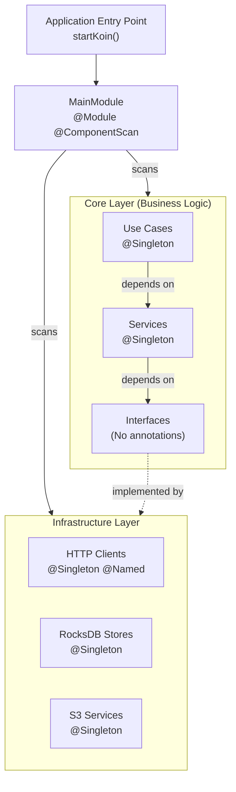

# Koin Dependency Injection

This document describes how dependency injection is implemented using Koin Annotations with Jakarta (JSR-330) compatibility in the nvdb-tnits project.

## What is Koin?

**Koin** is a pragmatic, lightweight dependency injection framework for Kotlin that uses a simple DSL for declaring dependencies. Unlike reflection-based frameworks like Spring or Dagger, Koin uses Kotlin's functional features for a fast, idiomatic approach.

**Key benefits:**

- No code generation (except when using annotations)
- Pure Kotlin DSL
- Easy to learn and use
- Minimal performance overhead
- Perfect for Kotlin Multiplatform

**Documentation:** [insert-koin.io](https://insert-koin.io)

## Koin Annotations 2.2+

This project uses **Koin Annotations 2.2+**, which introduces **JSR-330 (Jakarta Inject) compatibility**. This means you can use standard Jakarta annotations instead of Koin-specific annotations, making the code more portable and familiar to developers from other DI frameworks.

**Blog post:** [Koin Annotations 2.2 - JSR-330 Compatibility](https://blog.insert-koin.io/koin-annotations-2-2-jsr-330-compatibility-smart-configurations-and-scope-archetypes-5b2f4c8536c1)

### Jakarta Annotations Supported

| Jakarta Annotation | Purpose                                  | Koin Equivalent   |
|--------------------|------------------------------------------|-------------------|
| `@Singleton`       | Single instance throughout app lifecycle | `@Single`         |
| `@Named("name")`   | Named qualifier for disambiguation       | `@Named("name")`  |
| `@Inject`          | Constructor injection marker             | Automatic in Koin |

## Project Structure

The project follows **Clean Architecture** with dependency injection managed by Koin:

```
tnits-generator/
├── MainModule.kt              # Koin configuration module
├── core/
│   ├── api/                   # Interfaces (ports)
│   ├── useCases/             # Use case orchestration (@Singleton)
│   ├── services/             # Business logic (@Singleton)
│   └── presentation/         # Output formatting (@Singleton)
└── infrastructure/           # Implementations (adapters) (@Singleton)
    ├── http/                 # API clients
    ├── rocksdb/              # Storage implementations
    └── s3/                   # S3/MinIO implementations
```

**Dependency Rule:** Dependencies flow inward - `infrastructure` → `core/services` → `core/api`. The core never depends on infrastructure. This rule is automatically enforced by Konsist architecture tests (see `ArchitectureTest.kt`).

## MainModule Configuration

The `MainModule` is annotated with Koin annotations to enable component scanning and configuration:

```kotlin
@Module
@Configuration
@ComponentScan
class MainModule {

    @Singleton
    fun appConfig() = loadConfig()

    @Singleton
    fun uberiketApiConfig(appConfig: AppConfig) = appConfig.uberiketApi

    @Singleton
    @Named("uberiketHttpClient")
    fun uberiketHttpClient(config: UberiketApiConfig) =
        createUberiketHttpClient(config.baseUrl)

    @Singleton
    fun minioClient(config: AppConfig): MinioClient =
        config.s3.let { s3Config ->
            MinioClient.builder()
                .endpoint(s3Config.endpoint)
                .credentials(s3Config.accessKey, s3Config.secretKey)
                .build()
        }
}
```

**Key annotations:**

- `@Module` - Marks this class as a Koin module
- `@Configuration` - Indicates this module contains configuration
- `@ComponentScan` - Automatically scans the package for annotated classes

## Declaring Dependencies

### Using @Singleton Annotation

The most common pattern is to annotate classes with `@Singleton` for constructor injection:

```kotlin
@Singleton
class TnitsSnapshotCycle(
    private val rocksDbBackupService: RocksDbS3BackupService,
    private val nvdbBackfillOrchestrator: NvdbBackfillOrchestrator,
    private val nvdbUpdateOrchestrator: NvdbUpdateOrchestrator,
    private val cachedVegnett: CachedVegnett,
    private val tnitsExportService: TnitsExportService,
) {
    suspend fun execute() {
        rocksDbBackupService.restoreIfNeeded()
        nvdbBackfillOrchestrator.performBackfill()
        nvdbUpdateOrchestrator.performUpdate()
        // ...
    }
}
```

**Benefits:**

- Koin automatically resolves all constructor parameters
- No need to manually declare in a module
- Type-safe dependency resolution
- Compile-time validation with KSP

### Named Dependencies

Use `@Named` to distinguish between multiple instances of the same type:

```kotlin
@Singleton
@Named("uberiketHttpClient")
fun uberiketHttpClient(config: UberiketApiConfig): HttpClient =
    HttpClient(CIO) {
        defaultRequest {
            url(config.baseUrl)
        }
    }

@Singleton
@Named("datakatalogHttpClient")
fun datakatalogHttpClient(config: DatakatalogApiConfig): HttpClient =
    HttpClient(CIO) {
        defaultRequest {
            url(config.baseUrl)
        }
    }
```

**Usage in consuming class:**

```kotlin
@Singleton
class UberiketApiGateway(
    @Named("uberiketHttpClient")
    private val httpClient: HttpClient
) : UberiketApi {
    // Implementation
}
```

### Interface Binding

Koin automatically binds implementations to their interfaces when using `@Singleton`:

```kotlin
// Interface
interface VeglenkerRepository {
    fun get(id: Long): List<Veglenke>?
}

// Implementation - automatically binds to interface
@Singleton
class VeglenkerRocksDbStore(
    private val rocksDbContext: RocksDbContext
) : VeglenkerRepository {
    override fun get(id: Long): List<Veglenke>? {
        // Implementation
    }
}
```

Koin will:

1. Register `VeglenkerRocksDbStore` as a singleton
2. Automatically bind it to `VeglenkerRepository` interface
3. Allow injection by interface type

**Location:** `infrastructure/rocksdb/VeglenkerRocksDbStore.kt`

## Application Startup

### Starting Koin with Annotations

The application uses the `@KoinApplication` annotation for automatic Koin initialization. KSP generates a `startKoin()` extension function that handles all module registration automatically.

**Step 1: Declare KoinApplication object**

```kotlin
@KoinApplication
object ProductionApp
```

**Step 2: Initialize Koin in main function**

```kotlin
suspend fun main(args: Array<String>) {
    log.info("Starting NVDB TN-ITS application on process ${ProcessHandle.current().pid()}")
    val app = ProductionApp.startKoin()

    when (args.firstOrNull()) {
        "snapshot" -> app.koin.get<TnitsSnapshotCycle>().execute()
        "update" -> app.koin.get<TnitsUpdateCycle>().execute()
        "auto", null -> app.koin.get<TnitsAutomaticCycle>().execute()
        else -> {
            log.error("Unknown command '${args.first()}', use one of 'snapshot', 'update', or 'auto'")
        }
    }

    log.info("NVDB TN-ITS application finished")
    app.koin.get<MinioClient>().close()
}
```

**Key points:**

1. `@KoinApplication` - Triggers KSP to generate `startKoin()` extension function
2. `ProductionApp.startKoin()` - Returns `KoinApplication` with all modules automatically registered
3. `app.koin.get<T>()` - Resolve dependencies from the Koin container
4. No manual module registration needed - KSP discovers all `@Module` annotated classes

### Dependency Resolution

Dependencies are resolved using the `koin` property from the application:

```kotlin
// Get instance from Koin container
val useCase = app.koin.get<TnitsSnapshotCycle>()
useCase.execute()
```

**Benefits of this approach:**

- **Zero boilerplate** - No manual `modules()` calls
- **Compile-time safety** - KSP generates code at compile time
- **Automatic discovery** - All modules are found via component scanning
- **Type-safe** - Generated code is fully type-checked

## Advanced Features

### Compile-Time Validation

Koin Annotations with KSP provides compile-time validation:

**In `build.gradle.kts`:**

```kotlin
ksp {
    arg("KOIN_CONFIG_CHECK", "true")
}
```

This enables:

- Missing dependency detection at compile time
- Circular dependency detection
- Type mismatch detection

**Benefits:**

- Catch configuration errors before runtime
- Faster development feedback
- More confidence in dependency graph

## Architecture Integration

### Clean Architecture Layers



### Dependency Flow

**Following Clean Architecture:**

1. **Core defines interfaces** (ports) - No Koin annotations needed
2. **Infrastructure implements interfaces** (adapters) - Annotated with `@Singleton`
3. **Services depend on interfaces** - Constructor injection
4. **Koin resolves at runtime** - Binds implementations to interfaces

**Example:**

```kotlin
// Core API - Interface (port)
interface VegobjekterRepository {
    suspend fun get(typeId: Int, objektId: Long): Vegobjekt?
}

// Infrastructure - Implementation (adapter)
@Singleton
class VegobjekterRocksDbStore(
    private val rocksDbContext: RocksDbContext
) : VegobjekterRepository {
    override suspend fun get(typeId: Int, objektId: Long): Vegobjekt? {
        // Implementation
    }
}

// Core Service - Depends on interface
@Singleton
class TnitsExportService(
    private val vegobjekterRepository: VegobjekterRepository // ← Injected interface
) {
    suspend fun export() {
        val obj = vegobjekterRepository.get(105, 12345)
        // Process...
    }
}
```

**Benefits:**

- Core remains independent of infrastructure
- Easy to swap implementations
- Better testability

## Pros and Cons

### Advantages of Koin Annotations

✅ **Type Safety**

- Constructor injection is type-checked at compile time
- KSP validation catches errors early

✅ **Less Boilerplate**

- No manual module declarations for simple cases
- Component scanning reduces configuration

✅ **Jakarta Compatibility**

- Standard `@Singleton` annotation
- Portable to other DI frameworks if needed
- Familiar to developers from Spring/Jakarta EE

✅ **Clean Architecture Support**

- Automatic interface binding
- Dependency inversion principle naturally enforced
- Core stays independent of DI framework

✅ **Performance**

- No reflection at runtime (with annotations)
- Minimal overhead
- Fast startup time

### Disadvantages

❌ **KSP Dependency**

- Requires KSP (Kotlin Symbol Processing)
- Additional build step
- Slower incremental builds

❌ **Limited Dynamic Behavior**

- Annotations are static
- Less flexible than DSL for runtime configuration
- Can't easily modify dependency graph at runtime

❌ **Learning Curve**

- Developers need to understand annotation processing
- Mix of Jakarta and Koin concepts
- Component scanning can be "magical" for newcomers

❌ **Debugging**

- Generated code can be harder to trace
- Error messages from KSP can be cryptic
- Less explicit than manual DSL declarations

### When to Use Annotations vs DSL

**Use Annotations when:**

- Building a large application with many classes
- Want compile-time validation
- Need standard Jakarta annotations for portability
- Following clean architecture patterns

**Use DSL when:**

- Need dynamic module loading
- Runtime configuration is required
- Working with legacy code
- Need fine-grained control over scopes

## Comparison with Other DI Frameworks

| Feature                 | Koin Annotations | Spring             | Dagger/Hilt |
|-------------------------|------------------|--------------------|-------------|
| **Setup Complexity**    | Low              | High               | High        |
| **Runtime Performance** | Excellent        | Good               | Excellent   |
| **Compile Time**        | Fast             | Slow               | Very Slow   |
| **Learning Curve**      | Easy             | Moderate           | Steep       |
| **Kotlin Support**      | Native           | Good               | Good        |
| **Code Generation**     | Minimal (KSP)    | Heavy (Reflection) | Heavy (APT) |
| **Jakarta Annotations** | ✅ Yes            | ✅ Yes              | ❌ No        |
| **Multiplatform**       | ✅ Yes            | ❌ No               | ❌ No        |

## Best Practices

### 1. Use Constructor Injection

**Good:**

```kotlin
@Singleton
class MyService(
    private val repository: Repository,
    private val logger: Logger
) {
    fun process() { /* ... */
    }
}
```

**Avoid:**

```kotlin
class MyService : KoinComponent {
    private val repository by inject<Repository>() // Harder to test
    private val logger by inject<Logger>()
}
```

### 2. Depend on Interfaces, Not Implementations

**Good:**

```kotlin
@Singleton
class TnitsExportService(
    private val repository: VegobjekterRepository // ← Interface
)
```

**Avoid:**

```kotlin
@Singleton
class TnitsExportService(
    private val repository: VegobjekterRocksDbStore // ← Concrete class
)
```

### 3. Use Named Qualifiers Sparingly

Only when you truly have multiple instances of the same type:

**Good:**

```kotlin
@Named("production")
@Singleton
fun productionDb(): Database = createProductionDb()

@Named("testing")
@Singleton
fun testingDb(): Database = createTestDb()
```

**Avoid overuse:**

```kotlin
@Named("userRepository")
@Singleton // ← Unnecessary
fun userRepository(): UserRepository = ...
```

### 4. Keep Modules Organized

Organize by feature or layer:

```
MainModule.kt          # Configuration and infrastructure
CoreModule.kt          # Business logic (if not using @ComponentScan)
TestModule.kt          # Test-specific dependencies
```

### 5. Enable Compile-Time Checks

Always enable in `build.gradle.kts`:

```kotlin
ksp {
    arg("KOIN_CONFIG_CHECK", "true")
}
```

## Migration Guide

### From Manual DSL to Annotations

**Before (DSL):**

```kotlin
val myModule = module {
    single { UserRepository(get()) }
    single { UserService(get(), get()) }
}
```

**After (Annotations):**

```kotlin
@Singleton
class UserRepository(private val db: Database)

@Singleton
class UserService(
    private val repository: UserRepository,
    private val logger: Logger
)
```

Just add `@Singleton` and remove manual module declarations!

## Troubleshooting

### Common Issues

**Problem:** "No definition found for..."

**Solution:** Ensure the class is:

1. Annotated with `@Singleton`
2. In a package scanned by `@ComponentScan`
3. Not abstract or interface without implementation

**Problem:** Circular dependencies

**Solution:** Refactor to break the cycle:

- Extract common dependencies
- Use lazy injection with `by inject()`
- Restructure classes

**Problem:** Named dependency not found

**Solution:** Verify `@Named("name")` matches exactly in both declaration and injection

## Related Documentation

- [Architecture Overview](ARCHITECTURE.md) - System architecture with Koin
- [Concepts Glossary](CONCEPTS.md) - Composition root pattern
- [Testing Guide](TESTING.md) - Testing with Koin
- [Koin Documentation](https://insert-koin.io) - Official Koin docs
- [Koin Annotations 2.2 Blog Post](https://blog.insert-koin.io/koin-annotations-2-2-jsr-330-compatibility-smart-configurations-and-scope-archetypes-5b2f4c8536c1)
