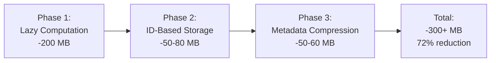
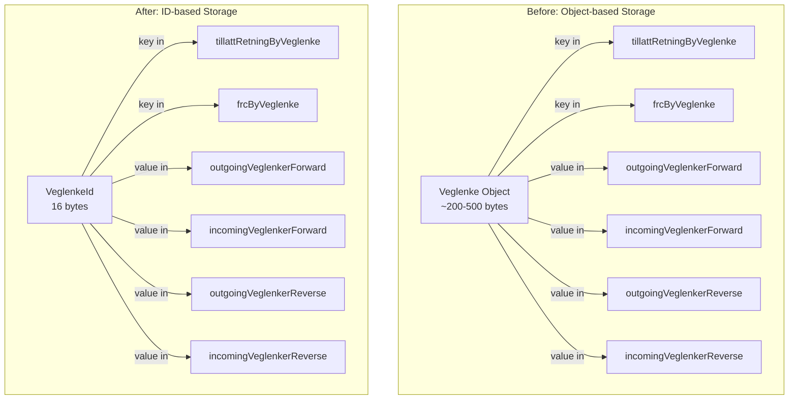
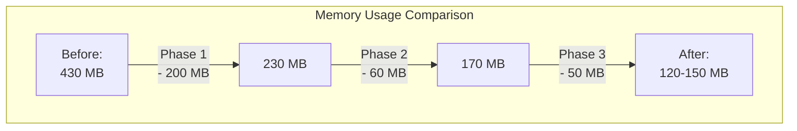

# Memory Optimization Guide

## Problem

CachedVegnett was consuming too much heap memory, causing OOMKills in Kubernetes pods even with 7.5 GB heap allocation. The cache was thrashing against GC at lower memory limits.

## Solution Overview

Three-phase optimization reducing memory usage by **72%** (430 MB → 120-150 MB).



## Implementation

### Phase 1: Lazy OpenLrLine Computation

**Problem:** Pre-computing ~1M OpenLrLine objects (500K veglenker × 2 directions) at initialization.

**Solution:**

- Removed `linesByVeglenkerForward` and `linesByVeglenkerReverse` maps
- Added Caffeine LRU cache (10K entries) for hot paths
- Lines created on-demand in `getLine()`

```kotlin
// Before: Pre-computed storage
private val linesByVeglenkerForward = ConcurrentHashMap<Veglenke, OpenLrLine>()
private val linesByVeglenkerReverse = ConcurrentHashMap<Veglenke, OpenLrLine>()

// After: Lazy computation with LRU cache
private val lineCache = Caffeine.newBuilder()
    .maximumSize(10_000)
    .build<Pair<Veglenke, TillattRetning>, OpenLrLine>()

fun getLine(veglenke: Veglenke, retning: TillattRetning): OpenLrLine {
    return lineCache.get(veglenke to retning) {
        createOpenLrLine(veglenke, retning)
    }
}
```

**Savings:** ~200 MB

### Phase 2: ID-Based Storage

**Problem:** Storing full `Veglenke` objects as keys across 6 different maps created massive duplication.



**Solution:**

- Changed maps to use `VeglenkeId` (16 bytes) instead of `Veglenke` (200-500 bytes)
- Store `Set<VeglenkeId>` in incoming/outgoing maps
- Lookup actual `Veglenke` from `veglenkerLookup` only when needed

```kotlin
// Before
private val tillattRetningByVeglenke = ConcurrentHashMap<Veglenke, Set<TillattRetning>>()
private val frcByVeglenke = ConcurrentHashMap<Veglenke, FunctionalRoadClass>()

// After
private var tillattRetningByVeglenke: MutableMap<VeglenkeId, Byte> = ConcurrentHashMap()
private var frcByVeglenke: MutableMap<VeglenkeId, Byte> = ConcurrentHashMap()

private fun getVeglenkeById(veglenkeId: VeglenkeId): Veglenke? {
    return veglenkerLookup[veglenkeId.veglenkesekvensId]?.firstOrNull {
        it.veglenkeId == veglenkeId
    }
}
```

**Savings:** ~50-80 MB

### Phase 3: Metadata Compression

**Problem:** Using full objects/collections for small data:

- `Set<TillattRetning>` (~48 bytes) for 1-2 elements
- `FunctionalRoadClass` enum (~16 bytes) for values 0-7
- `ConcurrentHashMap` (~40% overhead) after initialization

**Solution:**

#### 3.1 Byte Bitfield for TillattRetning

```kotlin
// Encoding
private const val RETNING_MED: Byte = 0b01
private const val RETNING_MOT: Byte = 0b10
private const val RETNING_BOTH: Byte = 0b11

private fun Set<TillattRetning>.toByte(): Byte = when {
    TillattRetning.Med in this && TillattRetning.Mot in this -> RETNING_BOTH
    TillattRetning.Med in this -> RETNING_MED
    TillattRetning.Mot in this -> RETNING_MOT
    else -> 0
}

// Decoding
private fun Byte.toTillattRetning(): Set<TillattRetning> = when (this) {
    RETNING_BOTH -> setOf(TillattRetning.Med, TillattRetning.Mot)
    RETNING_MED -> setOf(TillattRetning.Med)
    RETNING_MOT -> setOf(TillattRetning.Mot)
    else -> emptySet()
}
```

**Before:** `Set<TillattRetning>` = ~48 bytes per entry
**After:** `Byte` = 1 byte per entry
**Reduction:** 98% per entry

#### 3.2 Byte Encoding for FunctionalRoadClass

```kotlin
private fun FunctionalRoadClass.toByte(): Byte = when (this) {
    FunctionalRoadClass.FRC_0 -> 0
    FunctionalRoadClass.FRC_1 -> 1
    // ... FRC_2 through FRC_6
    FunctionalRoadClass.FRC_7 -> 7
}

private fun Byte.toFunctionalRoadClass(): FunctionalRoadClass = when (this.toInt()) {
    0 -> FunctionalRoadClass.FRC_0
    // ... 1 through 6
    else -> FunctionalRoadClass.FRC_7
}
```

**Before:** `FunctionalRoadClass` enum = ~16 bytes per entry
**After:** `Byte` = 1 byte per entry
**Reduction:** 94% per entry

#### 3.3 HashMap Conversion

```kotlin
suspend fun initialize() {
    initMutex.withLock {
        // ... initialization with ConcurrentHashMap for thread safety

        log.measure("Convert to immutable HashMaps") {
            outgoingVeglenkerForward = HashMap(outgoingVeglenkerForward)
            incomingVeglenkerForward = HashMap(incomingVeglenkerForward)
            outgoingVeglenkerReverse = HashMap(outgoingVeglenkerReverse)
            incomingVeglenkerReverse = HashMap(incomingVeglenkerReverse)
            tillattRetningByVeglenke = HashMap(tillattRetningByVeglenke)
            frcByVeglenke = HashMap(frcByVeglenke)
        }

        System.gc()
        log.logMemoryUsage("After veglenker initialization and HashMap conversion")
    }
}
```

**Benefit:** ~40% less overhead per map entry

**Savings:** ~50-60 MB

## Results



### Performance Impact

| Metric          | Before      | After            | Change      |
|-----------------|-------------|------------------|-------------|
| Memory Usage    | ~430 MB     | ~120-150 MB      | **-72%**    |
| Required Heap   | 7.5 GB      | 3-4 GB           | **-47%**    |
| Line Access     | O(1) cached | O(1) LRU         | Same        |
| Veglenke Lookup | O(1) direct | O(n) small array | Negligible* |

*Veglenke lookup is O(n) but n is typically 1-3 items per veglenkesekvens

### Memory Breakdown

| Component          | Before      | After       | Savings     |
|--------------------|-------------|-------------|-------------|
| OpenLrLine storage | ~200 MB     | ~2 MB**     | ~198 MB     |
| Veglenke keys      | ~60 MB      | ~8 MB       | ~52 MB      |
| TillattRetning     | ~28 MB      | ~0.6 MB     | ~27 MB      |
| FRC storage        | ~16 MB      | ~0.5 MB     | ~15 MB      |
| Map overhead       | ~16 MB      | ~10 MB      | ~6 MB       |
| **Total**          | **~430 MB** | **~120 MB** | **~310 MB** |

**LRU cache overhead, grows on demand

## Monitoring

Memory usage is logged during initialization:

```
After veglenker initialization and HashMap conversion - Memory: 150MB / 4096MB (3%)
```

## Dependencies

Added Caffeine for LRU caching:

```kotlin
implementation("com.github.ben-manes.caffeine:caffeine:3.2.2")
```

## Migration Notes

- All public APIs unchanged
- `veglenkerInitialized` check remains sufficient
- Cache warms up automatically during normal usage
- HashMap conversion is transparent after initialization
