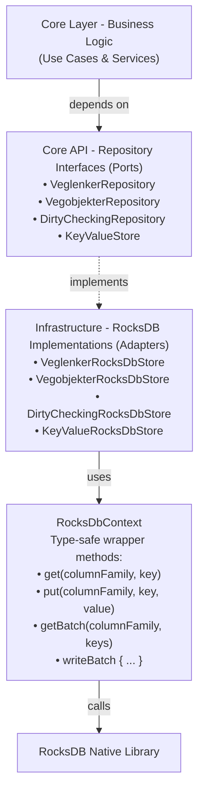

# Storage Architecture

This document describes the RocksDB-based storage layer used in nvdb-tnits.

Diagrams are written in [Mermaid](https://mermaid.js.org) syntax; use [IntelliJ Mermaid Plugin](https://plugins.jetbrains.com/plugin/20146-mermaid) to view them in the IDE.

## Overview

The application uses **RocksDB** as its primary storage engine, replacing traditional SQL databases. RocksDB is an embedded key-value store optimized for fast storage on SSD and flash drives.

**Why RocksDB?**

- High write throughput for bulk loading
- Efficient batch operations
- Built-in compression (LZ4)
- No separate database server needed
- Embedded in the application process

**Documentation:** [rocksdb.org](https://rocksdb.org)

## Storage Location

```
veglenker.db/              # RocksDB database directory
├── 000001.log            # Write-ahead log
├── CURRENT               # Current manifest file pointer
├── MANIFEST-000002       # Database metadata
├── OPTIONS-000003        # RocksDB options
└── *.sst                 # Sorted string table files (data)
```

The database is stored locally on disk and can grow to several GB depending on data volume.

## Column Families

RocksDB uses **column families** to logically separate different types of data. Think of them as tables in a relational database, but with independent storage and compression settings.

### Column Family Schema

Defined in: `core/services/storage/ColumnFamily.kt`

| Column Family               | Purpose              | Key Format                    | Value Format                    |
|-----------------------------|----------------------|-------------------------------|---------------------------------|
| **DEFAULT**                 | RocksDB default      | -                             | -                               |
| **KEY_VALUE**               | Application state    | String                        | Various (timestamps, IDs)       |
| **VEGLENKER**               | Road network links   | Long (veglenkesekvensId)      | List&lt;Veglenke&gt; (protobuf) |
| **VEGOBJEKTER**             | Road objects         | Composite (typeId + objektId) | Vegobjekt (protobuf)            |
| **DIRTY_VEGLENKESEKVENSER** | Changed road links   | Long (veglenkesekvensId)      | Empty                           |
| **DIRTY_VEGOBJEKTER**       | Changed road objects | Composite (typeId + objektId) | Empty                           |
| **EXPORTED_FEATURES**       | Export metadata      | Composite (typeId + objektId) | ExportedFeature (protobuf)      |

### Example: VEGLENKER Column Family

**Key:** Veglenkesekvens ID as 8-byte Long

```
[0x00, 0x00, 0x00, 0x00, 0x00, 0x00, 0xA1, 0x23]  // ID: 41251
```

**Value:** List of Veglenke objects serialized with Protocol Buffers

```
[protobuf binary data representing List<Veglenke>]
```

### Example: VEGOBJEKTER Column Family

**Key:** Composite of vegobjekt or stedfesting prefix (1 byte) + type ID (4 bytes) + ID (vegobjekt if prefix is 0, veglenksekvens if prefix is 1) (8 bytes) + Vegobjekt ID (8 bytes, only if prefix is 1)

```
// Vegobjekt: 0, Type: 105 (speed limit), Object: 85283590
[0x00] [0x00, 0x00, 0x00, 0x69] [0x00, 0x00, 0x00, 0x00, 0x05, 0x16, 0x8B, 0x06]
// Stedfesting: 1, Type: 105, Reflink: 1, Object: 85283590
[0x01] [0x00, 0x00, 0x00, 0x69] [0x00, 0x00, 0x00, 0x00, 0x00, 0x00, 0x00, 0x01] [0x00, 0x00, 0x00, 0x00, 0x05, 0x16, 0x8B, 0x06]
```

## Storage Abstraction Layer

The application uses a clean abstraction layer to encapsulate RocksDB operations.

### Architecture



### Key Classes

#### RocksDbContext

**Location:** `infrastructure/rocksdb/RocksDbContext.kt`

Core context managing database connection, column families, and providing wrapper methods.

**Key responsibilities:**

- Database initialization and lifecycle management
- Column family creation and mapping
- Thread-safe access to database resources
- Wrapper methods for type-safe operations

**Important methods:**

```kotlin
// Single operations
fun get(columnFamily: ColumnFamily, key: ByteArray): ByteArray?
fun put(columnFamily: ColumnFamily, key: ByteArray, value: ByteArray)
fun delete(columnFamily: ColumnFamily, key: ByteArray)

// Batch operations
fun getBatch(columnFamily: ColumnFamily, keys: Collection<ByteArray>): List<ByteArray?>
fun writeBatch(columnFamily: ColumnFamily, operations: List<BatchOperation>)

// Unit-of-work pattern
inline fun writeBatch(block: WriteBatchContext.() -> Unit)

// Iteration
fun newIterator(columnFamily: ColumnFamily): RocksIterator
fun streamEntriesByPrefix(columnFamily: ColumnFamily, prefix: ByteArray): Sequence<Pair<ByteArray, ByteArray>>
```

#### VeglenkerRocksDbStore

**Location:** `infrastructure/rocksdb/VeglenkerRocksDbStore.kt`

Repository for road network data storage.

**Example usage:**

```kotlin
val store = VeglenkerRocksDbStore(rocksDbContext)

// Single get
val veglenker = store.get(veglenkesekvensId = 41251)

// Batch get
val veglenkerMap = store.batchGet(listOf(41251, 41252, 41253))

// Upsert
store.upsert(41251, listOf(veglenke1, veglenke2))

// Batch update with dirty marking
rocksDbContext.writeBatch {
    store.batchUpdate(
        mapOf(
            41251 to listOf(veglenke1),
            41252 to null  // Delete
        )
    )
}
```

#### WriteBatchContext

**Location:** `core/services/storage/WriteBatchContext.kt`

Provides Unit-of-Work pattern for atomic multi-operation transactions.

**Example:**

```kotlin
rocksDbContext.writeBatch {
    // All operations are atomic - either all succeed or all fail
    veglenkerStore.batchUpdate(updates)
    dirtyCheckingStore.markDirty(veglenkesekvensIds)
    keyValueStore.setLastProcessedEventId(eventId)
}
```

## Serialization

All data is serialized using **Protocol Buffers** (protobuf) for efficient binary storage.

**Why Protocol Buffers?**

- Compact binary format
- Fast serialization/deserialization
- Type-safe schema evolution
- Cross-language compatibility

**Library:** `kotlinx.serialization.protobuf.ProtoBuf`

**Example serialization:**

```kotlin
// Serialize
val veglenker = listOf(Veglenke(...))
val bytes = ProtoBuf.encodeToByteArray(
    ListSerializer(Veglenke.serializer()),
    veglenker
)

// Deserialize
val veglenker = ProtoBuf.decodeFromByteArray(
    ListSerializer(Veglenke.serializer()),
    bytes
)
```

See: `model/Veglenke.kt`, `VeglenkerRocksDbStore.kt:108`

## Batch Operations

Batch operations are crucial for performance when dealing with large datasets.

### BatchOperation Sealed Class

```kotlin
sealed class BatchOperation {
    data class Put(val key: ByteArray, val value: ByteArray) : BatchOperation()
    data class Delete(val key: ByteArray) : BatchOperation()
}
```

### Batch Write Example

```kotlin
val operations = listOf(
    BatchOperation.Put(key1, value1),
    BatchOperation.Put(key2, value2),
    BatchOperation.Delete(key3)
)

rocksDbContext.writeBatch(ColumnFamily.VEGLENKER, operations)
```

**Atomicity guarantee:** All operations in a batch succeed or fail together.

## Configuration

RocksDB is configured for optimal bulk loading and storage efficiency.

### Compression

**Type:** LZ4 compression
**Benefit:** ~3-5x storage reduction with minimal CPU overhead

```kotlin
options.setCompressionType(CompressionType.LZ4_COMPRESSION)
```

### Bulk Loading

```kotlin
options.prepareForBulkLoad()
```

**Benefits:**

- Disables compaction during bulk load
- Optimizes for sequential writes
- Significantly faster initial data loading

### Column Family Options

Each column family uses the same compression and optimization settings for consistency.

```kotlin
val columnFamilyOptions = ColumnFamilyOptions().apply {
    setCompressionType(CompressionType.LZ4_COMPRESSION)
}
```

## State Management

Application state is tracked in the `KEY_VALUE` column family.

### Tracked State

| Key                          | Value Type | Purpose                           |
|------------------------------|------------|-----------------------------------|
| `last_processed_event_id`    | Long       | Track incremental update progress |
| `last_snapshot_{typeId}`     | Instant    | Last snapshot timestamp           |
| `last_update_{typeId}`       | Instant    | Last update timestamp             |
| `last_update_check_{typeId}` | Instant    | Last update check timestamp       |
| `backfill_complete_{typeId}` | Boolean    | Backfill status                   |

**Access via:** `KeyValueRocksDbStore` (infrastructure/rocksdb/) and extension functions in `core/extensions/KeyValueStoreExtensions.kt`

## Dirty Checking System

The application tracks which data has changed to enable efficient delta processing.

### How It Works

1. **Mark dirty:** When data is updated, mark it as dirty
2. **Query dirty:** Find all dirty items for processing
3. **Process:** Generate exports for dirty items
4. **Clear dirty:** Mark as clean after successful processing

### Dirty Veglenkesekvenser

**Column family:** `DIRTY_VEGLENKESEKVENSER`

Tracks which road segments have changed.

```kotlin
dirtyCheckingStore.markVeglenkesekvensAsDirty(veglenkesekvensId)
val dirtyIds = dirtyCheckingStore.getAllDirtyVeglenkesekvensIds()
dirtyCheckingStore.clearDirtyVeglenkesekvenser()
```

### Dirty Vegobjekter

**Column family:** `DIRTY_VEGOBJEKTER`

Tracks which road objects have changed, organized by type.

```kotlin
dirtyCheckingStore.markVegobjektAsDirty(typeId = 105, objektId = 85283590)
val dirtyIds = dirtyCheckingStore.getAllDirtyVegobjektIds(typeId = 105)
dirtyCheckingStore.clearDirtyVegobjekter(typeId = 105)
```

**Key format:** `typeId (4 bytes) + objektId (8 bytes)`

### Stedfesting-Based Dirty Queries

Find all vegobjekter positioned on dirty veglenkesekvenser:

```kotlin
val dirtyObjects = dirtyCheckingStore.findVegobjekterOnDirtyVeglenkesekvenser(
    typeId = 105
)
```

This enables cascade updates: when a road segment changes, find all speed limits on that segment.

See: `infrastructure/rocksdb/DirtyCheckingRocksDbStore.kt`

## Backup and Restore

The application uses RocksDB's native backup engine for consistent snapshots.

### Backup to S3

```kotlin
rocksDbBackupService.createBackup()
```

**Process:**

1. Create RocksDB backup using BackupEngine
2. Compress backup directory to tar.gz
3. Upload to S3/MinIO

**S3 path:** `s3://{bucket}/rocksdb-backup/rocksdb-backup.tar.gz`

### Restore from S3

```kotlin
rocksDbBackupService.restoreIfNeeded()
```

**Conditions:**

- Only restores if local database is empty or doesn't exist
- Automatically runs on application startup

**Process:**

1. Download tar.gz from S3
2. Extract to temporary directory
3. Restore using RocksDB BackupEngine
4. Clean up temporary files

See: `infrastructure/RocksDbS3BackupService.kt`

## Performance Characteristics

### Write Performance

| Operation                | Approximate Speed |
|--------------------------|-------------------|
| Single write             | ~10,000/sec       |
| Batch write (1000 items) | ~200,000/sec      |
| Bulk load (initial)      | ~500,000/sec      |

### Read Performance

| Operation               | Approximate Speed |
|-------------------------|-------------------|
| Single read             | ~100,000/sec      |
| Batch read (1000 items) | ~500,000/sec      |
| Iteration               | ~1,000,000/sec    |

**Note:** Performance varies with data size, hardware, and compression.

### Storage Efficiency

With LZ4 compression:

- Raw data: ~2-3 GB
- Compressed: ~600-900 MB
- Compression ratio: ~3-4x

## Thread Safety

### Safe Operations

- **Concurrent reads:** Multiple threads can read simultaneously
- **Iterator usage:** Use separate iterators per thread
- **Batch operations:** Atomic across column families

### Unsafe Operations

- **Concurrent writes to same key:** Use batch operations or locks
- **Iterator reuse:** Create new iterators per thread

### Synchronization

Critical sections use `@Synchronized`:

```kotlin
@Synchronized
fun clear() {
    close()
    File(dbPath).deleteRecursively()
    initialize()
}
```

See: `infrastructure/rocksdb/RocksDbContext.kt`

## Common Patterns

### Get or Default

```kotlin
val veglenker = veglenkerStore.get(id) ?: emptyList()
```

### Batch Process

```kotlin
val ids = listOf(1L, 2L, 3L, 4L, 5L)
val batchResults = veglenkerStore.batchGet(ids)
```

### Streaming Large Datasets

```kotlin
rocksDbContext.streamEntriesByPrefix(ColumnFamily.VEGLENKER, prefix)
    .map { (key, value) -> deserialize(value) }
    .filter { it.lengde > 100.0 }
    .forEach { process(it) }
```

### Atomic Multi-Operation

```kotlin
rocksDbContext.writeBatch {
    veglenkerStore.batchUpdate(updates)
    dirtyCheckingStore.markDirty(ids)
    keyValueStore.setTimestamp(now)
}
```

## Debugging and Inspection

### Check Database Size

```kotlin
val totalKeys = rocksDbContext.getTotalSize()
val veglenkerCount = rocksDbContext.getEstimatedKeys(ColumnFamily.VEGLENKER)
```

### Iterate All Keys

```kotlin
rocksDbContext.newIterator(ColumnFamily.VEGLENKER).use { iterator ->
    iterator.seekToFirst()
    while (iterator.isValid) {
        println("Key: ${iterator.key().toLong()}")
        iterator.next()
    }
}
```

### Clear Specific Column Family

```kotlin
rocksDbContext.clear(ColumnFamily.DIRTY_VEGLENKESEKVENSER)
```

### Complete Database Reset

```kotlin
rocksDbContext.clear()  // Deletes entire database and reinitializes
```

## Troubleshooting

### Database Corruption

**Symptoms:** `RocksDBException: Corruption`

**Solution:**

1. Delete `veglenker.db/` directory
2. Restore from S3 backup or re-run backfill

### Out of Disk Space

**Symptoms:** Write failures, slow performance

**Solution:**

1. Check disk usage: `du -sh veglenker.db/`
2. Trigger compaction: RocksDB automatic
3. Clear unnecessary data

### Memory Issues

**Symptoms:** OOM during bulk loading

**Solution:**

1. Increase JVM heap: `-Xmx4g`
2. Process data in smaller batches
3. Use streaming operations

## Related Documentation

- [Architecture Overview](ARCHITECTURE.md) - System architecture
- [Data Flow](DATA_FLOW.md) - How data flows through storage
- [Getting Started](GETTING_STARTED.md) - Setup instructions
